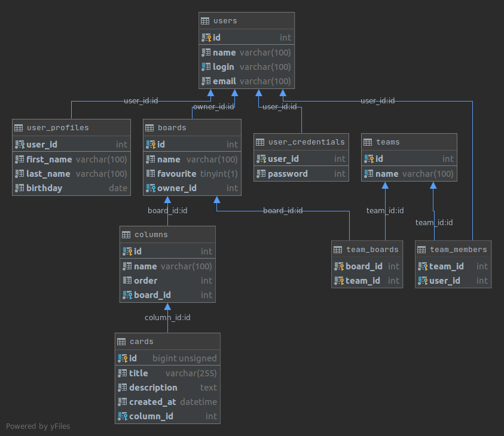

# Trello_homework
Homework application performed as part of the java dev course from LevelUp:
https://levelp.ru/courses/programmirovanie/basics-of-programming-in-the-java-language-level-2/

Tasks:

1.Подумайте, пожалуйста, на схемой базы данных trello: какие таблицы в ней могут быть, какие колонки в таблицах, какие ограничения можно наложить на колонки, а также связи между таблицами.
Список таблиц с занятия:
    users
    boards
    columns
    cards

2.Перенесите данные из таблицы users в таблицу user_credentials: значения из колонки password.
Добавьте таблицу user_profile
Добавьте связь между таблицей team и таблицей boards.

3.Сделайте авторизацию через базу: вы вводите с консоли логин/пароль и если такая пара существует в базе, то тогда авторизация пройдена успешно. Если нет, выдать сообщение об ошибке.

4.Добавьте возможность зарегистрироваться в программе.
Пользователю на старте программа предлагает либо выполнить вход, либо зарегистрироваться. При регистрации пользователь вводит данные: имя, логин, пароль и email. После регистрации, пользователю предлагается выполнить вход с парой логин/пароль, которую он ввел ранее при регистрации.

Добавить возможность создания/редактирования/удаления и получения всех досок, которые есть у пользователя.
В меню это вынести в отдельную категорию. После входа пользователь должен увидеть следующее:
1. Управление досками

После выбора этого меню, ему должно открыться следующее меню:
1. Добавить доску
2. Изменить доску
   и так далее. 
